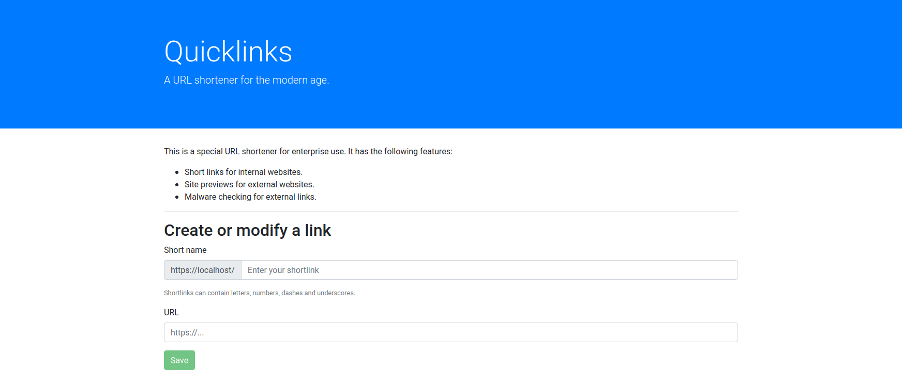
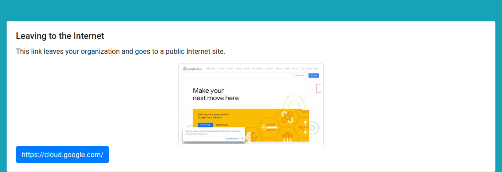
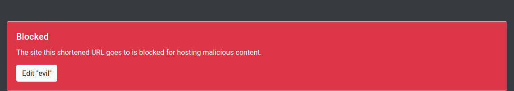

# Link Shortener

This example Spring application is an enterprise-ready link-shortener.
The URL shortener has the following behaviour:
 
 * URLs internal to your own domain (via the `shortener.internal.domain` application variable) get redirected to.
 * URLs on the Internet get vulnerability scanned:
   * If the URL is malicious, the redirect is blocked.
   * If the URL is benign, the user is shown a preview of the site and clicking through opens in a new tab to protect privacy.
   * If the vulnerability scanner is down, a warning is shown.

## Screenshots

Landing Page:



External redirect with screenshot:



Malicious site block:



## Deploying

You must bind a CloudSQL MySQL instance to the app using the GCP Service Broker.
It also needs an API token to access the vulnerability scanner and screenshot generator.
You can add the API token to the `google.api.key` field in `application.properties` file or inject it via the `GOOGLE_API_KEY` environment variable.

You can setup the environment using:

```bash
$ cf create-service google-cloudsql-mysql mysql-db-g1-small short-links-db
$ cf service short-links-db
$ cf bind-service link-shortener short-links-db -c '{"role":"cloudsql.editor"}'
```

Edit the manifest.yml file to add your API key.


You can build and deploy the app using:

```bash
$ mvn package -DskipTests=true
$ cf push -p target/spring-boot-example-linkshortener-0.0.1-SNAPSHOT.jar
```

## Technologies Showcased

* CloudSQL MySQL
* Google Safebrowsing API
* Google Pagespeed API

## Open Source Client-Side Technologies Used

This application uses the following OSS client-side technologies:

* Vue.js - MIT License
* Bootstrap - MIT License
* jQuery - MIT License